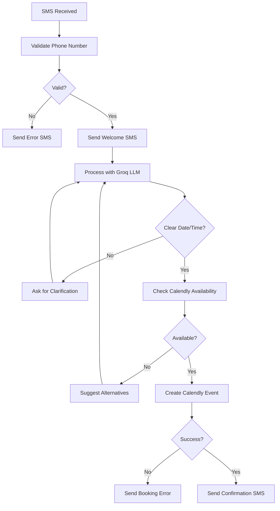

# WhatsApp Appointment Booking Agent

A comprehensive LangGraph-powered WhatsApp agent that automates appointment booking through Calendly integration, featuring natural language processing, LangSmith monitoring, and robust error handling.
After deployment, configure your Twilio WhatsApp webhook:

1. Go to your Twilio Console
2. Navigate to Messaging → Settings → WhatsApp Sandbox
3. Set webhook URL to: `https://your-domain.com/webhook/whatsapp` Features

- **WhatsApp Conversation Management**: Natural language appointment booking via WhatsApp
- **Phone Number Validation**: Robust validation using libphonenumber
- **AI-Powered Processing**: Groq LLaMA for intelligent conversation handling
- **Calendly Integration**: Real-time availability checking and appointment creation
- **LangSmith Monitoring**: Comprehensive tracing, metrics, and alerts
- **Error Handling**: Graceful error recovery and user-friendly fallbacks
- **Session Management**: Persistent conversation state tracking
- **Testing Suite**: Unit tests, integration tests, and conversation simulations

## 📋 Prerequisites

- **Python 3.9+**
- **Twilio Account** with WhatsApp Sandbox access
- **Groq API Key** for LLM processing
- **Calendly API Access** (Professional plan or higher)
- **LangSmith Account** for monitoring
- **Redis Instance** for session storage (optional, falls back to in-memory)

## 🛠️ Installation

### 1. Clone and Setup Environment

```bash
git clone <repository-url>
cd SMSagent

# Create virtual environment
python -m venv venv

# Activate virtual environment
# Windows:
venv\Scripts\activate
# macOS/Linux:
source venv/bin/activate

# Install dependencies
pip install -r requirements.txt
```

### 2. Environment Configuration

Copy the environment template and configure your API keys:

```bash
cp .env.template .env
```

Edit `.env` with your actual API credentials:

```env
# Twilio Configuration
TWILIO_ACCOUNT_SID=your_twilio_account_sid_here
TWILIO_AUTH_TOKEN=your_twilio_auth_token_here
TWILIO_PHONE_NUMBER=+1234567890

# Groq API Configuration
GROQ_API_KEY=your_groq_api_key_here

# Calendly API Configuration
CALENDLY_API_TOKEN=your_calendly_api_token_here
CALENDLY_USER_URI=https://api.calendly.com/users/your_user_id_here

# LangSmith Configuration
LANGSMITH_API_KEY=your_langsmith_api_key_here
LANGSMITH_PROJECT_NAME=sms-appointment-booking

# Redis Configuration (optional)
REDIS_URL=redis://localhost:6379

# Optional Settings
DEBUG_MODE=true
PORT=8000
```

### 3. API Setup Instructions

#### Twilio Setup
1. Create a [Twilio account](https://www.twilio.com/try-twilio)
2. Get a phone number with SMS capabilities
3. Find your Account SID and Auth Token in the Console Dashboard
4. Configure webhook URL (see deployment section)

#### Groq API Setup
1. Sign up at [Groq](https://console.groq.com/)
2. Generate an API key
3. Ensure you have access to LLaMA models

#### Calendly API Setup
1. Upgrade to Calendly Professional plan or higher
2. Go to [Calendly Developer Settings](https://calendly.com/integrations/api_webhooks)
3. Generate a Personal Access Token
4. Find your User URI in the API documentation

#### LangSmith Setup
1. Create account at [LangSmith](https://smith.langchain.com/)
2. Generate an API key
3. Create a new project for the SMS agent

## 🚀 Running the Application

### Development Mode

```bash
# Start the application
python main.py

# Or with uvicorn for more control
uvicorn main:app --host 0.0.0.0 --port 8000 --reload
```

The application will start on `http://localhost:8000`

### Production Mode

```bash
# Set production environment
export DEBUG_MODE=false

# Start with production settings
uvicorn main:app --host 0.0.0.0 --port 8000 --workers 4
```

## 🔧 Testing

### Unit Tests

```bash
# Run all unit tests
python -m pytest tests/test_sms_agent.py -v

# Run specific test class
python -m pytest tests/test_sms_agent.py::TestPhoneValidation -v
```

### Integration Tests

```bash
# Run integration tests
python -m pytest tests/test_integration.py -v --asyncio-mode=auto
```

### Conversation Simulation

```bash
# Run end-to-end conversation simulation
python tests/conversation_simulation.py
```

This will:
- Simulate 8 different conversation scenarios
- Test successful bookings, error handling, and edge cases
- Generate detailed reports and metrics
- Save results to timestamped files

### Testing Individual Components

```bash
# Test phone validation
python nodes/phone_validator.py

# Test Groq processing
python nodes/groq_processor.py

# Test Calendly integration
python nodes/calendly_checker.py

# Test SMS sending
python nodes/twilio_sender.py
```

## 🌐 Deployment

### Docker Deployment

1. **Create Dockerfile**:

```dockerfile
FROM python:3.9-slim

WORKDIR /app
COPY requirements.txt .
RUN pip install --no-cache-dir -r requirements.txt

COPY . .
EXPOSE 8000

CMD ["uvicorn", "main:app", "--host", "0.0.0.0", "--port", "8000"]
```

2. **Build and run**:

```bash
docker build -t sms-agent .
docker run -p 8000:8000 --env-file .env sms-agent
```

### Cloud Deployment (AWS/GCP/Azure)

#### Using AWS Lambda + API Gateway

1. **Install serverless dependencies**:
```bash
pip install mangum
```

2. **Create lambda handler**:
```python
from mangum import Mangum
from main import app

handler = Mangum(app)
```

3. **Deploy with Serverless Framework** or use AWS CDK

#### Using Google Cloud Run

```bash
# Build and deploy
gcloud builds submit --tag gcr.io/PROJECT_ID/sms-agent
gcloud run deploy --image gcr.io/PROJECT_ID/sms-agent --platform managed
```

### Webhook Configuration

After deployment, configure your Twilio webhook:

1. Go to your Twilio Console
2. Navigate to Phone Numbers > Manage > Active numbers
3. Click on your SMS-enabled phone number
4. Set webhook URL to: `https://your-domain.com/webhook/twilio`
5. Set HTTP method to `POST`
6. Save configuration

## 📊 Monitoring and Debugging

### LangSmith Dashboard

1. **Access your LangSmith project**: https://smith.langchain.com/
2. **View conversation traces**: Each SMS conversation creates a complete trace
3. **Monitor performance metrics**:
   - Conversation success rate
   - Average response time
   - Error rates by component
   - API latency metrics

### Built-in Endpoints

- **Health Check**: `GET /health`
- **Metrics**: `GET /metrics`
- **API Documentation**: `GET /docs` (Swagger UI)

### Logs and Debugging

The application uses structured logging. Key log events:

```bash
# View logs in real-time
tail -f app.log

# Filter by session ID
grep "session-123" app.log

# Filter by error level
grep '"level":"error"' app.log
```

### Alert Configuration

LangSmith alerts are configured in `graph.yaml`:

- **High Error Rate**: >10% error rate triggers email alert
- **API Latency**: >5s response time triggers Slack alert
- **SMS Delivery Failures**: >10 failures in 10min triggers email

## 🔄 Conversation Flow



## 🧪 Example Conversations

### Successful Booking

```
User: "I want to book an appointment tomorrow at 2pm"
Agent: "👋 Welcome to our appointment booking service! I'll check if tomorrow at 2 PM is available for you."
Agent: "✅ Your appointment is confirmed!
📅 Consultation  
🗓️ January 23, 2025
🕐 2:00 PM
🔗 Add to calendar: https://calendly.com/event/abc123"
```

### Clarification Needed

```
User: "I need to meet next week"
Agent: "I'd be happy to help you schedule for next week! What day and time would work best for you?"
User: "Friday at 10am"
Agent: "Perfect! I'll check if Friday at 10 AM is available..."
```

### No Availability

```
User: "Can we meet at 11pm tonight?"
Agent: "❌ Appointments are only available between 9 AM and 6 PM. Please choose a time within business hours.

Here are some examples:
• Tomorrow at 2pm
• Next Monday at 10am  
• Friday afternoon"
```

## 🛡️ Security and Privacy

- **Phone Number Masking**: Phone numbers are masked in logs (last 4 digits only)
- **API Key Protection**: All API keys are environment variables
- **Input Validation**: Robust validation for all user inputs
- **Rate Limiting**: Twilio provides built-in rate limiting
- **HTTPS Required**: All API communications use HTTPS
- **Session Timeout**: Sessions expire after 1 hour

## 🔧 Customization

### Adding New Event Types

1. **Update Calendly configuration** in `nodes/calendly_checker.py`
2. **Modify event creation logic** in `nodes/calendly_creator.py`
3. **Update conversation prompts** in `nodes/groq_processor.py`

### Changing Business Hours

Update validation in `nodes/groq_processor.py`:

```python
# Check business hours (9 AM to 6 PM)
if parsed_dt.hour < 9 or parsed_dt.hour >= 18:
    return {
        "valid": False,
        "error": "Appointments are only available between 9 AM and 6 PM"
    }
```

### Adding New Languages

1. **Update Groq prompts** with multilingual support
2. **Add language detection** in phone validation
3. **Create localized error messages** in error handler

### Custom Integrations

Replace Calendly with other calendar systems by implementing the same interface in:
- `nodes/calendly_checker.py`
- `nodes/calendly_creator.py`

## 📈 Performance Optimization

### Redis Configuration

For production, use Redis for session storage:

```bash
# Install Redis
# Ubuntu/Debian:
sudo apt-get install redis-server

# macOS:
brew install redis

# Start Redis
redis-server
```

### Scaling Considerations

- **Multiple Workers**: Use `--workers` flag with uvicorn
- **Load Balancing**: Deploy behind nginx or ALB
- **Database**: Consider PostgreSQL for persistent storage
- **Caching**: Redis for conversation state and API response caching
- **CDN**: CloudFlare for global edge distribution

## 🐛 Troubleshooting

### Common Issues

1. **SMS not received**:
   - Check Twilio webhook URL configuration
   - Verify phone number is SMS-capable
   - Check Twilio logs in console

2. **Groq API errors**:
   - Verify API key is correct
   - Check rate limits
   - Ensure model availability

3. **Calendly integration fails**:
   - Verify API token permissions
   - Check user URI format
   - Ensure Professional plan or higher

4. **LangSmith traces not appearing**:
   - Verify API key and project name
   - Check network connectivity
   - Review trace payload format

### Debug Mode

Enable debug mode for detailed logging:

```bash
export DEBUG_MODE=true
python main.py
```

### Log Analysis

Common log patterns to search for:

```bash
# Failed SMS deliveries
grep "sms_failure" app.log

# LLM processing errors
grep "groq_processing.*error" app.log

# Calendly API issues
grep "calendly.*error" app.log

# Session timeouts
grep "session_timeout" app.log
```

## 🤝 Contributing

1. Fork the repository
2. Create a feature branch
3. Add tests for new functionality
4. Ensure all tests pass
5. Submit a pull request

### Code Style

- Follow PEP 8 for Python code
- Use type hints where possible
- Add docstrings for all functions
- Maintain test coverage above 80%

## 📄 License

This project is licensed under the MIT License. See LICENSE file for details.

## 🆘 Support

For support and questions:

1. **Check the troubleshooting section** above
2. **Review the logs** for specific error messages
3. **Test individual components** to isolate issues
4. **Run conversation simulation** to validate flows
5. **Check LangSmith traces** for detailed execution data

---

**Built with ❤️ using LangGraph, LangSmith, Groq, Twilio, and Calendly**
